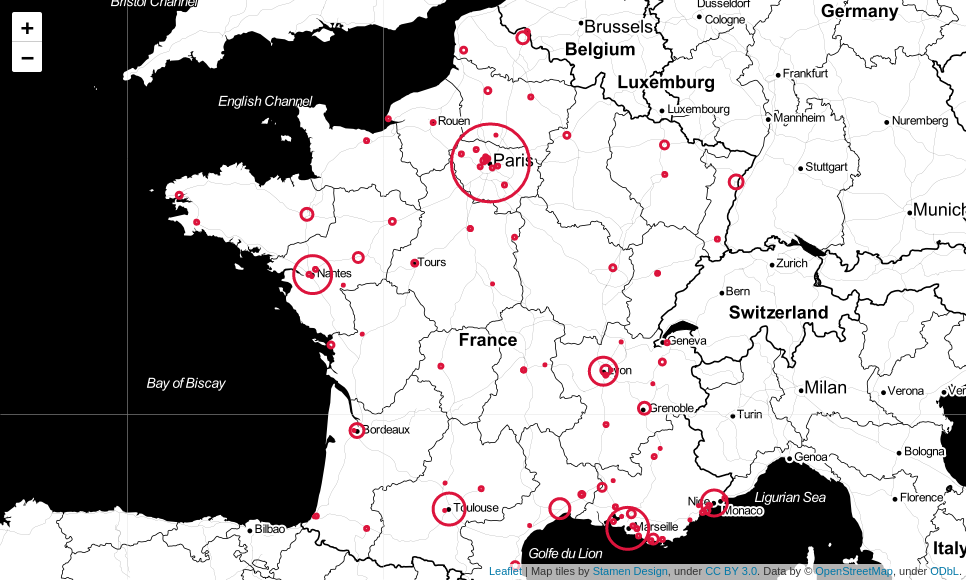

# no-mask map

* source: https://www.mesopinions.com/petition/enfants/port-masque-6-ans/112026

## Requirements

* jupyter notebook: https://www.digitalocean.com/community/tutorials/how-to-set-up-jupyter-notebook-with-python-3-on-ubuntu-18-04
* `pip install pyquery geopy folium`

## Usage

1. open `no_mask_map.ipynb`
2. build `url.txt`
3. run `wget` command to retrieve html content in `no_mask` folder
4. parse html content and display map with `folium`
